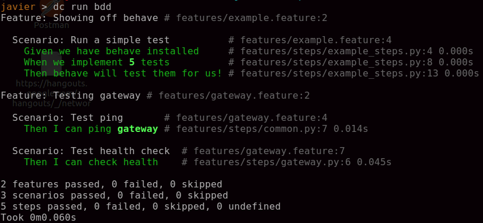

# Microservice stack

The purpose of this `microservice-stack` is to illustrate how a scalable and multilanguage docker microservice stack would work on a real environment.

It doesn't mean it is `perfect` or that you have to use this exact combination
of services to build your own.

Specially taking into account that some metodologies and technologies improve over the years / months.

# Stack overview

## Microservices (internal)
Services we have implemented for the purpose of this demo

* User (python flask): Microservice that allow us to create users and store them in postgres
* Slack (nodejs express): Microservice that sends a notification on Slack everytime we create an user
* Gateway (nodejs express): API layer
* BDD service to test behaviours in our stack, using `behave` for python, written in Gherkin language.

## Microservices (external)

Services available on dockerhub that we use as docker containers (check docker-compose.yml)

* Postgres: Database used by user to store users
* Redis: Database used by slack to store all the messages we send out
* RabbitMQ: Internal messagging system between microservices (not currently used, but implemented on services)

# Getting started

## Build services

    docker-compose build

## Run services

Run all services available in docker-compose, including databases

    docker-compose up -d

## Run queue consumers (rabbitmq) 

Some services have a `consumer` service that will 
consume messages from rabbitmq and process 
asynchronous messages.

    docker-compose up user-queue

## Run tests

* Python: docker-compose run user py.test
* Slack NodeJS: docker-compose run slack npm test
* Gateway NodeJS: docker-compose run gateway npm test

* BDDs (Python behave): docker-compose run bdd 




## Test create new user using REST

    curl -X POST http://localhost:8101/user -d '{"name": "foo", "email": "bar"}'  -H  'Content-Type: application/json'

## Test Post a slack message 

    curl -X POST http://localhost:8102/ -d '{"channel": "#user", "message": "User <id> created"}'  -H  'Content-Type: application/json'

## Heatlh checks

Run gateway and go to http://localhost/health to see the status of all the services. You will get something like:
```
    {
        "slack": {
            "time": 24,
            "response": "pong"
        },
        "user": {
            "time": 50,
            "response": "pong"
        }
    }
```

## API Layer 

The API layer is in charge or redirecting the external API requests to the correct microservice, 
potentially, this can be extended adding authentication, rate limiting, metrics, etc.

### Sample: How POST request works

If we send the following request to our API layer:
    curl -X POST localhost:8100/user -H 'content-type: application/json' -d '{"foo": "bar"}'

User makes POST request -> API -> User -> API -> User

The API Layer (nodejs) will redirect this request and the json body to User (python) , 
it will process the data and return a response back to the API layer, which will be returned to the user

# Missing stuff

* Authentication, potentially implemented in the API layer
* RPC sample 
* Websocket sample 
* Frontend
* Web api documentation
* Monitoring services (prometheus, zipkin)

# Conclussions and assumptions

### Multilanguage is fun, but try to keep it minimal

You will have to use similar implementations on multiple microservices (eg: rabbitmq integration). In order to minimize errors and potentially reuse the same code (you can build your own libraries), it's better to stick to similar languages.

### Use your favourite technologies and languages

Apart from docker and docker compose, the fact I use languages like javascript or python or services like redis, postgres or rabbitmq, doesn't mean you have to use the same.
I only use these technologies because they are very familiar to me and easy to implement. But a good alternative to rabbitmq for example, would be to use Kafka or SQS service on Amazon .

### Wrappers, wrappers, wrappers

It's common on a stack (specially when building tooling), to wrap common utils on classes, like creating a class for rabbitmq to simplify the messaging, trying to avoid specific rabbitmq logic.
 On this stack I didn't bother wrapping any shared logic, as it's very early stage. Be careful with wrappers specially when doing things on different languages.

 ### Microservices are not magic bullets

 Sometimes people say starting your stack by building microservices is not a good idea, because you don't understand what they will do at the beginning and you end up having unnecessary barriers in some places of the codebase. Ideally, you would build a single monolithic application and then split functionality in microservices along the way.

### Build your monitoring before start a big project

Monitoring is very useful to ensure everything works as
expected and also to debug if something gets wrong. 
Prometheus is a monitoring server tool that record endpoint latency, database connections, CPU and memory usage, etc. https://prometheus.io/
Zipkin is a tracing tool very useful to track the lifecycle of a message by passin headers on REST or queues. http://zipkin.io/

### Orchestration
This setup, is useful for small projects or development environment. On a real enviroment like Prod you will probably use an orchestrator to manage all your containers. I've used Rancher on AWS, but I strongly recommend Kubernetes, it's by far the best orchestrator available. 